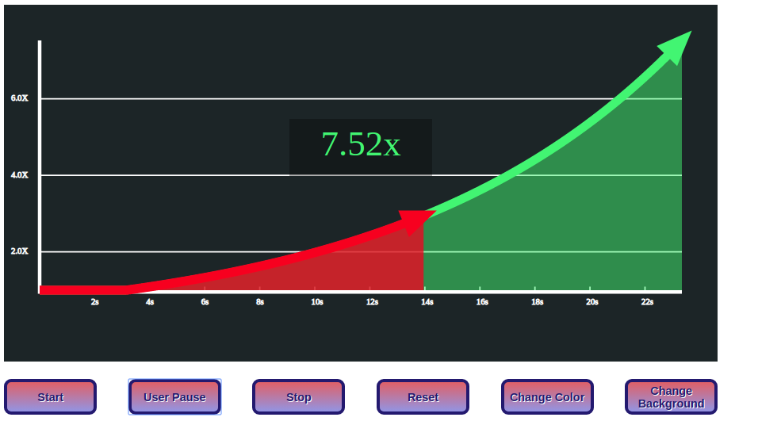

# recieved-data-as-a-function-of-time-diagram-javascript-code

### This is a javascript code that can be used for drawing a figure of data increasing over time.

## methods:

### controller.run_time()
call this method to start time.

### controller.raise_X(new_value)
this method will increase function to the new_value in the parentheses.

### controller.stop()
this method pauses the time elapsing

### ui.controller.changeColor("#------")
use this method to change figure color using a hexadecimal code of desired color.

### controller.user_interruption()
this method makes a section on the diagram with red color (becomes two distinct section)
 
 
 
 

